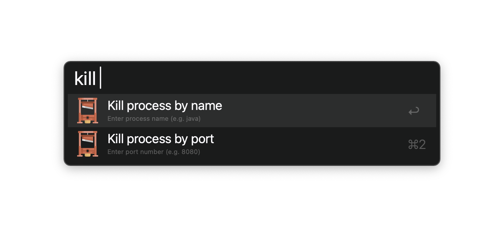
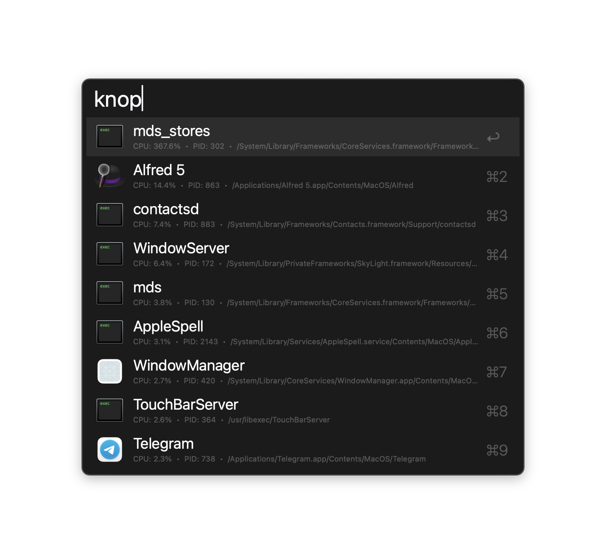
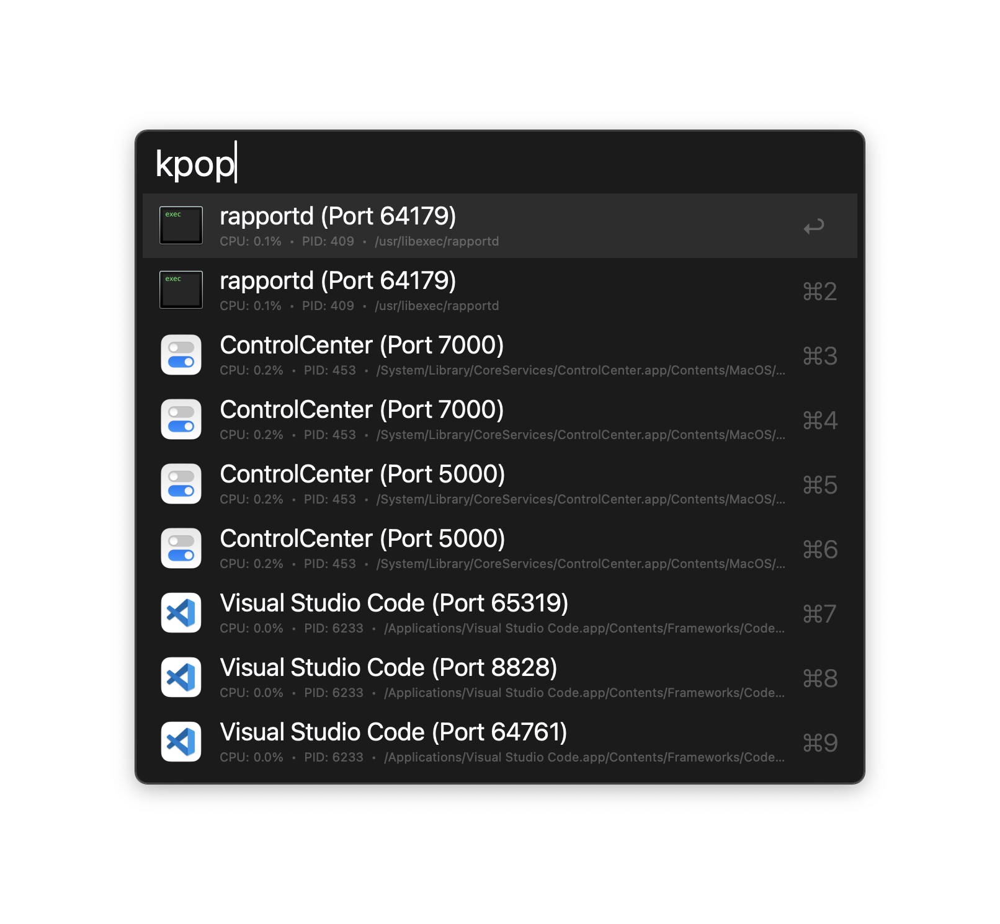

# Kill process

Find and kill processes by name or port.

## Usage

Pick a mode interactively via the `kill` keyword.

Search running processes by name via the `knop` keyword.

- <kbd>↩</kbd> Graceful kill (SIGTERM).
- <kbd>⌘</kbd><kbd>↩</kbd> Force kill (SIGKILL).
- <kbd>⌥</kbd><kbd>↩</kbd> Kill all matching processes.

Alternatively, search processes listening on a port via the `kpop` keyword.

- <kbd>↩</kbd> Graceful kill (SIGTERM).
- <kbd>⌘</kbd><kbd>↩</kbd> Force kill (SIGKILL).

Configure the Hotkey for faster triggering of each mode.

## Installation

[➡️ Download the latest release.](https://github.com/mbagrat/alfred-kill-process/releases/latest)

## About the developer

In my day job, I am a software engineer. If you find this project helpful, you
can support me via [🩷 GitHub
Sponsors](https://github.com/sponsors/mbagrat?frequency=one-time).
